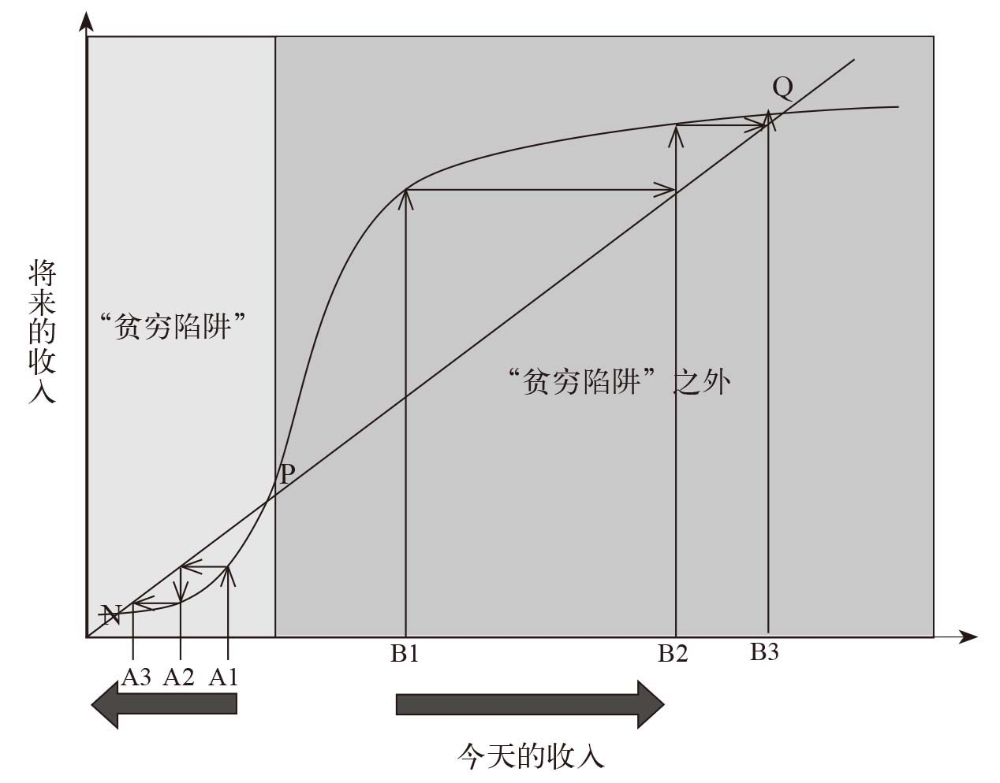
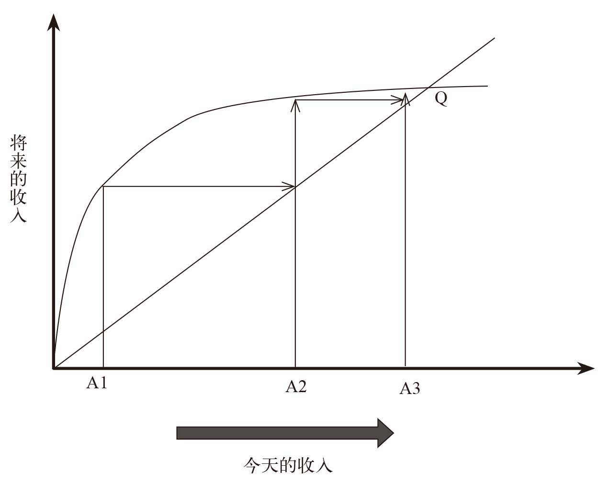
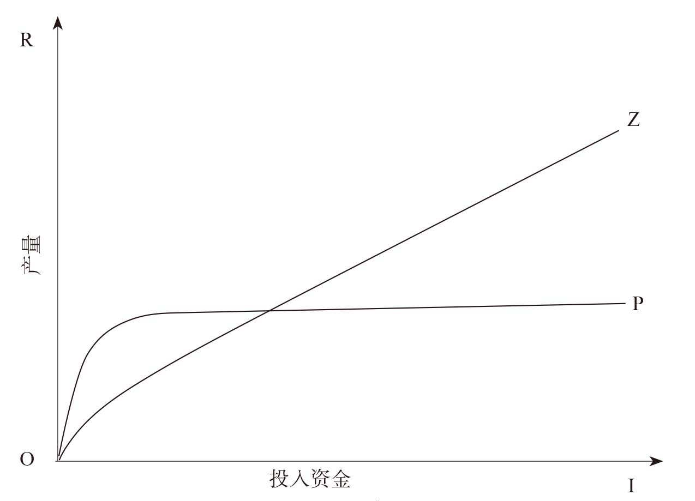
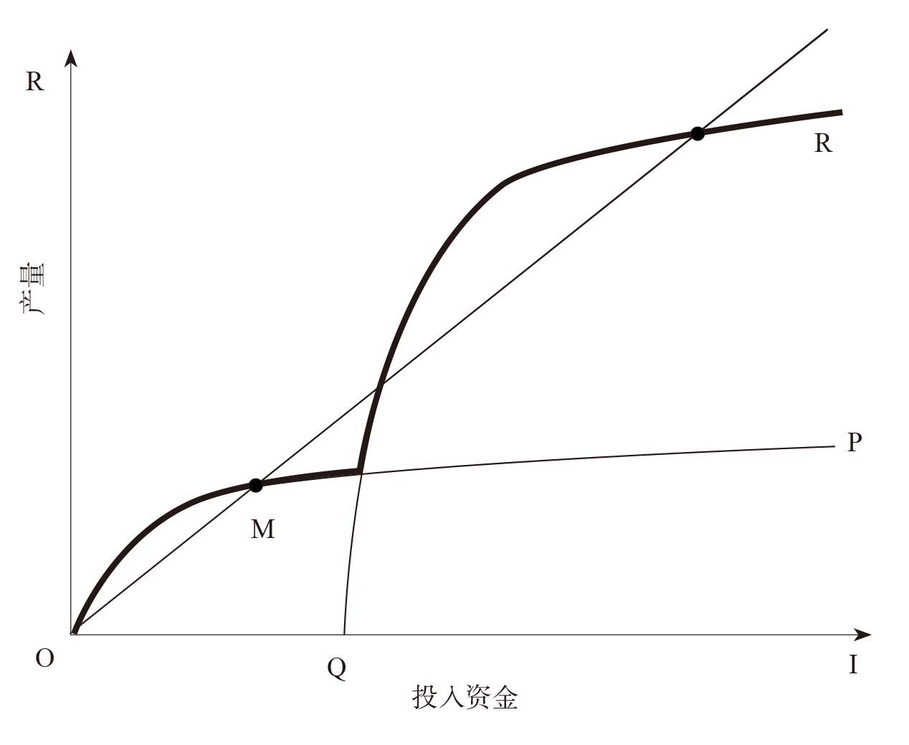

# 贫穷的本质  

## 0 前言  

有一点值得注意，即使这些人处于贫穷状态，他们几乎在所有方面都和我们一样。穷人与我们有相同的欲望和弱点，也并不比我们理性多少——正好相反，恰恰因为他们几乎一无所有，我们常常会发现，穷人在做选择时会非常谨慎：为了生存，他们都需要成为精打细算的经济学家。  

**精打细算的高手反而过不了幸福的日子，why？真是讽刺！**  

每天99美分的生活意味着，你接收信息的渠道也会受限——报纸、电视和书籍都要花钱来买，因此，你常常会对世界上其他人得到的特定信息一无所知。  
《贫穷的本质》一书揭示了穷人的经济生活，是我们看到其中所蕴含的丰富的经济学原理。这本书中的理论有助于我们了解穷人能实现什么，他们在哪些方面需要一些助力，以及他们为什么会需要这些助力。  

**当然，我是穷人，我也需要利用书中的观点来解决自身的问题。**

本书还指出了希望与知识的重要性，告诉我们即使在任务看上去无比艰难的情况下，我们依然要敢于坚持，成功并不总像看上去那样遥远。  

## 1 再好好想想  

### 1.1 重新审视贫穷问题  

宾夕法尼亚大学学生调查事件，说明了大多数人在面对贫穷等问题的感觉，我们的本能反应是慷慨，特别是在面对一个身陷困境的小女孩时。然而，正如宾夕法尼亚大学的学生一样，我们在重新考虑之后常常失去信心：我们捐的那点儿钱不过是沧海一粟，而且这些善款的安全性也得不到保障。  
这本书会让你再好好想想，如何摆脱那种贫穷的问题难以解决的感觉，从一系列具体问题出发，重新审视这一挑战。这些问题只要能得到恰当的定位并为人们真正理解，就能逐一得到解决。

**呼应本章主题！**  

### 1.2关于贫穷的主流认知  

作者认为主流学者对贫穷的认知都在关注大问题，而不是从解决单一问题入手。  
例如  

+ 杰弗里﹒萨克斯认为：贫困国家之所以贫困，原因在于这些国家往往都气候炎热、土地贫瘠、疟疾肆虐、四周被陆地所包围，因此，如果没有大量的原始投资助其解决这些地方性问题，这些国家很难提高自己的生产力。然后，这些国家却因为贫穷，无法支付投资回报，这就是“贫穷陷阱“。  
**与甘肃省何其相似**  

+ 另外一派，如威廉﹒伊斯特利、丹比萨﹒莫约认为：援助的弊大于利，援助使人们停止寻找自己解决问题的方法，腐蚀地方机构并削弱其作用，导致一些援助机构形同虚设。对于贫穷国家来说，最好遵循一个简单的原则：只要有自由市场和恰当的奖励机制，人们就能自己找到解决问题的方法，避免接受外国人或自己政府的施舍。  

**荒谬，几千年的实践已经证明了如果不改变一些因素，穷人永远是穷人；同样，几千年的历史中，还是有一些聪明人窥破天机，改变了命运.**  

真正有用的方式是从实际问题的角度去思考，这样就可以有针对性地找出解决具体问题的方法，而不是空谈外来援助。  

    随机对照试验  

    蚊帐问题：
    加利福尼亚大学的迪帕在肯尼亚进行了类似的实验。在蒂帕的实验中，随机选定的几个人在购买蚊帐时享受了不同程度的价格优惠。通过几个小组在接受不同价格时的行为进行比较。  

### 1.3 贫穷陷阱  

总体原则：对于几乎无钱可投的人来说，一旦收入或财富迅速增长的范围受限，那么他就会调入“贫穷陷阱“；但对于有能力投入的人来说，这一范围会极大的扩展。另一方面，如果穷人快速增收的潜能很大，而且这一潜能随着富裕程度的提高而逐渐减弱，那么“贫穷陷阱”也就不复存在了。  
下面两个图有利于厘清关于贫穷本质的这场争论，在研究这两个图时，我们要记住最重要的一点，即曲线的形状——我们会在本书中多次谈到这些形状。  

 
 **图1-1 S形曲线和“贫穷陷阱”**
  

对于相信贫穷陷阱的人来说，世界如图一那样，你今天的收入会影响将来的收入，这个将来有可能是明天、下个月、下一代。  
曲线的形状是关键，这条线一开始很平坦，然后突然升起，之后又逐渐变平，称之为“S形曲线”。  
这条S形曲线就是“贫穷陷阱”的来源。从对角线上来看，今天的收入等于明天的收入。对于处于“贫穷陷阱”地带的穷人来说，将来的收入低于今天的收入：曲线低于对角线。这就意味着，随着时间的流逝，这一地带的人会变的越来越穷，最终在N点陷入贫穷。对于那些起点在“贫穷陷阱”地带意外的人来说，明天的收入会高于今天的收入：至少从某种程度上说，他们会变得越来越富。  

**图1-2 反向S形曲线：不存在“贫穷陷阱”**
  

然而，很多经济学家认为，整个世界常常更像图1-2。此图表面，世界上不存在“贫穷陷阱”，因为最穷的人也能挣到比他们原来的收入更多的钱，他们会变得越来越富，直到他们的收入停止增长为止。此图暗示着，我们几乎没有必要帮助穷人了，一次性的施舍(如给某人足够的收入，让他以A2而不是今天的A1为起点)，并不能永久的提高一个人的收入，最多也只能让他前进的更快一些，并不能改变他们最终前进的方向。  

## 2 饥饿人口已达到10亿  

### 2.1 贫穷≠饥饿  

基于基本生理机制的S形曲线有着显而易见的含义：如果穷人有机会可以吃得多一点儿，他们就能做一些有意义的工作，走出“贫穷陷阱”地带，因此，穷人吃的越多越好。  
然而，这并非实际情况，对于大多数穷人，似乎并没有挨饿，食品消费只占农村极度贫困人口总消费的36%-79%，占城市贫困人口消费的53%-74%。也并不意味着他们把余下的钱花在购买其他生活必需品上。  
那么穷人会怎样花掉偶尔多出来的钱呢？以印度马哈拉施特拉邦为例，但穷人可以多买一点儿食物时，他们并不注重换取更多能力的食物，想法，会选择买一些口味更好、价钱更高的食品。以中国为例，对罗伯特·延森和诺兰·米勒来讲是不可思议的，即食品消费的“质量飞跃”，但大米或小麦的价格便宜了，那些得到补贴的家庭购买这两种粮食反而减少了，虾和肉的消费却提升了。  
再次表明：至少对于这些非常贫穷的城市家庭来说，他们并不是优先获取更多的能量，二十获取味道更好的能量。  

**“贫穷陷阱”可能不存在的一个原因就是，大多数人都能吃饱饭。**  

大多数人的贫穷状态，并非是由他们吃不饱饭造成的。  

### 2.2 穷人真的吃的好、吃的饱吗  

上节所述，穷人大多数都能吃饱，可问题是吃的饱不等于吃的好，例如南亚人大多数营养不良，身材瘦小。  
尽快对于个人成长来讲，基因构成的确至关重要，但人类在身高方面的基因差别是极其微小的。如果第一代母亲的孩子身材十分矮小，那么不妨原因可能在于，这一带母亲在童年时就营养不了，因此才会生下身材较为矮小的孩子。  

### 2.3 为什么穷人吃的这么少  

#### 2.3.1 谁知道

那些既要挣基本工资又要挣计件工资的人，他们在挣计件工资时要多吃25%的食物，干的越多，挣得越多。  
一种可能是，人们并没有意识到，让自己及子女吃得更好有什么价值，人们并不完全了解微量元素的重要性，即使科学家也一样。  
此外，但别人告诉自己应改变饮食结构时，人们一般都会持怀疑态度，这可能是因为人们一直钟爱自己吃的食物。  
因此穷人在选择食品时，主要考虑的并不是价格是否便宜，也不是有无营养价值，而是食品的口味怎么样。  

    乔治奥威尔在其《通向威根码头之路》(the road to wigan pier)一书中，成功的描述了英国穷人额生活。书中写道：  
    他们的食物主要有白面包、人造黄油、罐装牛肉、加糖茶和土豆——这些食物都很糟糕。如果他们多花点儿钱，去买一些健康食品，如橘子和全麦面包；或者，他们可以学《新政客》（New Statesman）的读者，为节省燃料而生吃胡萝卜，那样不是更好吗？是的，那样当然会更好，但问题是，没有人会这样做。还没等到要靠黑面包和生胡萝卜为生时，正常人早已饿得肚子咕咕叫了。而且，特别遗憾的一点是，你手里的钱越少，你就越不愿意购买健康食品。一位百万富翁可能喜欢以橘子汁和薄脆饼干当早餐，但一位失业人员是不会喜欢的……当你陷入失业状态，你并不想吃乏味的健康食品，而是想吃点儿味道不错的东西，总会有一些便宜而又好吃的食品诱惑着你。

#### 2.3.2 比食物更重要  

穷人常常拒绝我们为其想出的完美计划，因为他们不相信这些计划会有什么效果。这也是贯穿本书的一个主题。穷人饮食习惯的另一个解释是，在他们的生活中，还有比食物更重要的东西。  
如印度的天价婚礼花费、南非隆重的葬礼花费，这些属于世俗的、怕丢面子的结果。  
然而，将钱花在食品以外的地方或许并不完全处于压力。  

    在摩洛哥的一个偏远山村，我们遇见了一个叫欧查·姆巴克的人。我们问他，如果有更多的钱，他会用来做什么，他说会用来买更多的食品。我们接着问他，如果有更多更多的钱他会买什么，他说会买更多好吃的食品。于是，我们开始为他和他的家人感到遗憾，因为在我们坐着的房间里，我们注意到了一台电视机、抛物面天线及DVD播放机。我们又问他，如果他觉得一家人都吃不饱的话，为什么还要买这些东西呢？他笑着回答道：“哦，电视机比食物更重要！”  

**总体来说，穷人的首要选择显然是，让自己的生活少一点儿乏味。这可以是一台电视机，也可以是一点儿特别的食品，比如一杯加糖茶。**  

在没有电视机和收音机的情况下，我们很容易理解，为什么穷人要常常进行某种特别的家庭庆祝，比如说一场宗教仪式，或是为女儿办一场婚礼。人类对于美好生活的基本需求，或许可以解释为什么印度的视频消费一直都在下降。  
这一现象在奥威尔的《通向威根码头之路》一书中也有所涉及，他描述了穷人是怎样逃避沮丧的：  

    他们不会迁怒于自己的命运，而是通过降低标准来增强自己的忍耐力。然而，他们却不一定因此而专注必需品，也不一定会排斥奢侈品。因此，在长达10年的嫉妒沮丧期内，所有廉价奢侈品的消费都有所提高。  

**或许，尼尔波兹曼的《娱乐至死》一书中对此种现象有更深刻的心理学探讨。**  

本书原文中继续写道：  

    这些“嗜好”并非那些行为不慎重之人的冲动消费，而是他们经过深思熟虑做出的选择，不管内心的冲动如何驱使他们、外界如何对他们施压。欧查·姆巴克的电视机并不是赊账买的——他为此攒了几个月的钱。印度母亲也是一样，她们会提前10年或更长的时间，开始攒钱为自己8岁大的女儿准备婚礼，在这里买一件小首饰，在那里买一个不锈钢水壶。

我们眼中的穷人世界，常常是一片失去机遇的土地。我们会好奇，为什么他们不把买那些东西的钱攒下来，将钱投入到真正能使她们过的更好的地方？然而，穷人会更加怀疑那些想象中的机遇，怀疑其生活产生任何根本改变的可能性。他们的行为尺寸反应出这样一种想法，即任何值得做出的改变都要花很长时间。这也可以解释，为什么他们只关注当前，尽可能把日子过得愉快，在必要的场合参加庆祝活动。  

#### 2.3.3 基于营养说的“贫穷陷阱”真的存在吗  

基于营养说的“贫穷陷阱”的基本机制似乎不适用于成人。  
营养充足可能会为两类人带来更多的好处，即未出生的婴儿和幼儿，因为他们还不能自主选择食物。实际上，父母收入与其子女未来收入之间，可能也存在着一种S形曲线关系，这与子女在童年期间的营养摄入有关。这是因为，如果孩子在子宫内或童年早期吸收了充足的营养，那么他/她以后每年都会挣到更多的钱：经过一生的积累，这个孩子就会受益匪浅。  

穷人喜欢补贴的粮食，但我们前面谈到过，给他们提供更多的援助并不能使他们吃得更好。而且，他们主要的问题不在卡路里，而是其他营养成分。此外，仅仅靠给予穷人更多的钱，可能也不足以解决问题。即使收入增加，短期内他们可能也不会达到更好的营养状态。正如我们在印度看到的那样，穷人即使在自己收入增加的情况下，也不会吃得更多更好；除了食物之外，他们需要面对太多其他的压力和欲望。  

相反，对儿童及孕妇的直接营养投资，会产生巨大的社会回报。这方面的措施包括，向孕妇及儿童父母发放强化食品，对儿童进行学前或在校的抗蠕虫预防，向他们提供富含微量营养素的膳食，或者鼓励父母为补充营养而消费。  

## 3 提高全球居民健康水平容易吗  

### 3.1 人们不相信"好摘的果子"  

    曾经有个患痢疾的小孩来看病，护士们能给孩子母亲的只有一盒口服补液，然后，大多数母亲都不相信口服补液可以治病，他们想得到自己认为能够治病的药——一剂抗生素或一次静脉注射。
    护士们告诉我们，一旦一位母亲从医疗所拿走的是一包口服补液，那么她拥有都不会再来了。每年，护士们都会看到很多儿童死于痢疾，但他们觉得自己无能为力。  

消毒剂和口服补液并不是什么特例，还有其他相对“好摘的果子”可以改善人们的健康状况，挽救很多生命。那些方法简单、廉价，如果恰当使用，就能够节省大量资源。除了挽救生命，这些方法还可以为自身买单，然而，太多这种“果子”都未被摘下。并非人们不关心自己的健康，他们不但关心，而且还为此投入大量资源，他们只是把钱花在了别的地方，比如：并非任何时候都适用的抗生素、为时已晚的外科手术等。为什么要这样做呢？  

### 3.2 健康陷阱  

在萨克斯看来，有一种基于健康的“贫穷陷阱”，但我们可以向穷人提供“梯子”，帮他们逃离这些陷阱。  

### 3.3 为什么不更多的使用这些方法呢  

赞比亚人都知道消毒剂的好处，如果问他们什么可以用来净化饮用水，98%的赞比亚人都会提到消毒剂。然而，实际使用消毒剂进行水处理的人只有10%，即使当消毒剂的价格采用最大折扣时，愿意购买的人数出现了大幅增长，即使如此，仍有1/4的人不愿购买。  
蚊帐与消毒剂的实验十分相似，研究人员发现，人们对于蚊帐的价格十分敏感，几乎所有人都会去领免费的蚊帐。  
蚊帐和消毒剂的低需求量表明，健康问题依旧难以得到根本性的解决：逃出“贫穷陷阱”的“梯子”是存在的，但并非总是放在正确的地方，而且人们似乎不知道怎样踏上“梯子”，或者他们甚至根本不想那样做。  

### 3.4 改善健康的愿望  

纯净水、蚊帐、抗蠕虫药片或加铁面粉，尽管这些东西会给人们的健康带来很大好处，但人们似乎不愿为此话太多的金钱或事件。那么这是否意味着，穷人不关心自己的健康？有证据显示，结果恰恰相反。当被问及最近一个月以来是否感到“担心、紧张或不安”时，印度乌代布尔及南非农村约1/4的穷人回答“是”，这一比例比美国的还要高。  

### 3.5 钱什么也没换来  

因此，问题并不在于穷人为健康花了多少钱，二十他们的钱究竟花到哪儿去了。  
为什么穷人有时会拒绝便宜而有效的、能大大改善人们健康的方法，非要花很多钱去买那些毫无帮助的、很可能有害的东西？  

### 3.6 政府该受到责备吗  

如果人们不去公立医院，或许是因为他们对那里的服务并不感兴趣。为什么穷人对保健的要求如此之高，却对预防性的服务置之不理？  

### 3.7 免费意味着没用

心理沉没成本：人们更有可能会利用他们为之支付很多钱的东西，此外，人们可能会根据价格来判断质量：恰恰是由于某物品时廉价的，人们便有可能认为他没有价值。  

然而：大量严谨的实验表明，人们不怎么实用那些免费得到的东西的传闻有些言过其实了。  

如果原因不是补贴，那回事什么呢？  

### 3.8 信念  

    尽管权威医疗小组多次确认疫苗是安全的，但美国和英国的很多人都拒绝让自己换麻疹的孩子接种疫苗，因为他们认为这会导致孩子们患上自闭症。美国的麻疹病例正在增加，不过其他地方也是一样。  

    想一想穷国普通公民的情况。  

    西方国家的人民可以随时洞悉世界顶尖科学家们的观点，即使他们很难依此做出选择；对于几乎没有什么信息来源的穷人来说，他们的选择该有多难呢？  

    人们会根据自己的理解做出选择，但如果大多数人连基本的高中生理知识都不具备，就像我们看到的那样，他们就没理由去相信医生的能力与专长，因而他们的决定在很大程度上就是无的放矢。

**只有开放，才能愿意接受更多的观点；只有好奇，才会主动去学习并尝试有趣的东西；只有勇气，才会坦然承认自己之前步入歧路的错误，而换一种方式继续来过；只有坚持，才不会高估自己短期可达到的成就，而绝不会低估自己3-5年可以达到的高度。**  

**做到开放、好奇、勇气、坚持，一个人才会快乐、自信。毕竟快乐来自今天的自己比昨日更优秀，而不是来自和别人去攀比；毕竟自信来自一个人对自己生活的控制能力，而不是得到别人的认同与肯定。**  

### 3.9 脆弱的信念与必要的希望  

    穷人之所以会坚持那些看起来漏洞百出的信念，还有一个潜在的原因：在他们无能为力的情况下，希望变得至关重要。  

    "穷人根本就治不起大病，因为那会花很多钱，比如化验、住院，所以他们得了点小病就回来找我，我会给他们开点儿药，让他们感觉好一点"，换句话说，即使他们知道解决不了什么大问题，但还是要为自己的健康做点儿什么，这很重要。  

赛娃曼迪发现，即使医疗团队每月运转良好，仍有4/5的儿童没有接受完整的接种，于是该机构便考虑该怎样提高接种率。这时赛娃曼迪总会想到**信念**对于人们的意义。  

有些地方专家称，这一问题深深地植根于人们的信念体系。他们指出，疫苗接种在传统的信念体系中没有地位——在乌代布尔的农村及其他一些地区，传统的新年认为，儿童之所以会死去因为他们在公开场合看到了邪恶的眼睛，所以孩子出生后，父母是不会把他们带到外面的。  

而作者成功地劝说了赛娃曼迪的首席执行官尼力玛·科顿做了这样一个实验：向每次接种的人提供2磅达尔，如果能够完成全部接种，这个人还会得到一套不锈钢餐盘。
该实验取得巨大的成功，团队所在村庄的疫苗接种率增长了7倍。  

**实验表明：穷人似乎是相信一切的，但他们的很多信念并不坚定。他们不会因害怕邪恶的眼睛而拒绝接受达尔，这就意味着，他们其实知道自己无法对疫苗的费用与好处进行评估。当他们知道自己想要的是什么时，他们并不容易贿赂。**  

### 3.10 新年新愿望  

    疫苗接种遇到的阻力并不是很大，这表现在，在没有达尔奖励的村庄，77%的儿童都首次接受了疫苗接种：即使没有任何奖励，人们一开始似乎也愿意进入接种流程。问题在于，怎样使他们完成整个流程。这也正是全部接种率未超过38%的原因——奖励机制使人们来接种的次数增多，但不足以使他们完成全部5次接种，而那份免费的不锈钢餐盘似乎也不起作用了。  
**这一问题的产生处于同一个原因：年复一年，我们都很难坚持实行自己新年新愿望，尽管我们知道健身会使我们远离心脏病。**  

**时间矛盾**：我们对当前与对未来的看法是截然不同的。当前的我们是冲动的，很大程度上由感性与即时欲望支配：比如，健身是好的，现在放弃一点点舒适感去健身房，较之在没有迫切感的情况下去想这些事（明天再去健身房），当前的这种感觉更令人不愉快。  

**这就是拖延症啊。**  

    我们稍后会提到，穷人可以找到强迫自己省钱的方法，这需要具备十分灵活的经济头脑。如果他们真的相信，接种疫苗就像世界卫生组织所说的那样完美，他们可能就会想办法，克服自身拖延的天性。更合理的解释就是，他们之所以会拖延接种，是因为他们低估了接种的好处。  

### 3.11 我们的看法  

穷人所陷入的困境与我们其他人的困扰似乎是一样的——缺乏信息、信念不坚定、拖延。的确，我们并不贫穷，受过良好的教育，见多识广，但我们与穷人的差别其实很小，因为我们的认识比我们想象中的要少的多。  

我们的真正优势在于，很多东西是我们在不知不觉中得到的。我们住在有自来水的房子里，不用想着每天早晨往水里加消毒剂。下水道自行运转，我们甚至不知道是怎样运转的。我们大都相信医生会尽力为我们服务，公立医院会告诉我们该做什么，不该做什么……。而且，或许最重要的是，我们大多数人都无需担心是否有下一顿饭吃。换句话说，我们几乎用不着自己有限的自控及决断能力，而穷人则需要不断地运用这种能力。  

我们应该认识到，谁也没赢那么明智、耐心或博学到能够为自己的健康做出正确的决定。同样，对于那些生活在赋予国家的人来说，他们周围充满了无形的助推力。  

    这一切听上去都颇具家长式风气，不过从某种角度上来说，事实的确如此。对于生活在安全而干净的家中、躺在舒适沙发上的我们来说，痛斥家长式作风的危害、告诉自己该为自己的生活负责是轻而易举的。对于我们这些生活在富裕世界的人来说，我们目前不正是这种家长式作风的永久受益者吗？我们深深扎根于这一体系而浑然不觉。这个体系不仅可以将我们照顾得更好，而且我们也不需要去思考生活中的其他问题。  

**不过，我们应该真正认识到，仅凭信息并不能取得成功。这就是事物本身的规律，对于穷人来说是如此，对于我们也是一样。**  

## 4 全班最优  

### 4.1 引例  

作者的所见：40岁的寡妇珊塔玛，6个孩子的母亲，丈夫4年前死于阑尾炎，她没有保险，家里也拿不到任何抚恤金，三个年长的孩子都上了学，至少上到了八年级，另外两个小点儿的孩子都辍学了，女孩在邻居家地里干活儿。作者认为：由于父亲去世，孩子们被迫辍学，年龄大一点儿的孩子便开始干活儿挣钱。  

实际情况：珊塔玛纠正了作者的想法，丈夫去世后，她将家里的地租出去，自己干临时工，挣得钱可以满足一家人的基本需求。两个小一点儿的孩子之所以辍学，是因为他们自己不想去上学，经常逃学，最终母亲放弃了让他们上学的打算。  

发展中国家的学校对学生不具有吸引力，既不是因为入学难或缺乏人才需求，也不是因为家长拒绝让自己的孩子受教育。那么，阻碍究竟源自哪里呢？  

### 4.2 供求之战  

大多数政策制定者一直认为，教育其实很简单：我们要先将孩子们带进教师，最好由一位训练有素的老师任教，剩下的事情就好办了。  

这一目标进展程度喜人：撒哈拉沙漠以南非洲地区小学入学率由54%上升至70%，东亚及南亚则有75%上升至88%。 

让孩子上学是非常重要的一步，这正是学习的起点。然而，如果孩子们在学校里学不到什么东西，那么上学对他们来说就毫无用处，有些奇怪的是，学习的问题并未被摆在国际声明中十分突出的位置：千年发展目标中并没规定孩子们必须在学校里学到东西，只是说他们应完成基本的课程。  

据布拉瀚调查：印度7-14岁年龄组中接近35%的孩子读不出一个简单的段落，而几乎60%的孩子读不出一个简单的故事，只有30%的孩子会做二年级的数学题(基本除法)。

### 4.3 需求达人案例  

一些批评家认为，除非有明确需求，否则根本没有必要提供教育。对于需求达人来说，在他们看来，教育质量之所以低下，原因就在于家长们对教育不够重视，他们觉得教育真正的好处并不多，当教育回报足够高时，根本无需政府推动，入学率自然会提高。  

一个文明的社会不能允许儿童受教育的权利被父母的冲动或贪婪所剥夺，政府必须从经济角度考虑，让父母觉得送孩子上学是值得的，这就是教育政策所选择的新工具背后所折射出的理念：有条件现金转移。  

### 4.4 有条件现金转移的奇特历史  

如果父母的收入对是否进行教育投资很关键，那么有钱人家的孩子即使无任何天赋，也可以收到更多的教育，而天资聪颖的穷人家的孩子则有可能会被剥夺受教育的权利。因此，让市场操纵一切，并不能让每个孩子根据自己的能力接受教育。除非我们能够完全消除收入差距，否则公共供应方的干预就是必要的，这种干预可以使教育变得更廉价，使我们更容易实现这一社会目标：确保每个孩子都能得到一次机会。  

### 4.5 自上而下的教育政策有用吗  

从印尼、台湾的案例可以总结出，教育的方方面面都是人收益匪浅。那些喜欢阅读的人会轻松阅读报纸和公告栏，从而得知他们合适会从一项政府计划中收益。接受中级教育的人更有可能得到一份正式的工作，即使没有得到这样一份工作，他们也能把自己的生意做的很好。  

至此，由政府提供义务教育的供应策略和按市场需求决定的需求策略，这两种在哲学层面上相互对立的策略狮虎失去了重点，供应策略与需求策略没有利用互相排斥。供应本身就会带来好处，但需求也很重要。  

这一切并非意味着自上而下的教育策略一定会带来很多好处，虽然学生们在公立学校学到了东西，但公立学校的教育质量并不乐观。于是，基于需求的方法是否会更有效？难道说私立学校破解了教育质量的问题？  

### 4.6 私立学校

私立学校的孩子比公立学校的孩子学到的更多。然而，这并不意味着，私立学校的教学质量完美无缺。在比较私立学校的教学质量与经过简单干预后的教学质量时，我们已经看到了私立学校的缺陷。  

### 4.7 布拉瀚与私立学校  

### 4.8 期望的诅咒  

## 5 帕克·苏达苏达诺的大家庭  

### 5.1 引例  

桑贾伊·甘地是印度总理英迪拉·甘地的小儿子，1981年死于一场坠机事故，他认为，人口控制是印度发展计划的一个重要部分。  

人们普遍认为，英迪拉甘地之所以会在1977年的大选中失败，部分原因就在于这一计划使其失去了民心。因此新政府立即推翻了节育政策。这一举措包含着一种历史学家所喜欢的讽刺意义，即从长远角度来看，桑贾伊·甘地反而促进了印度人口的快速增长。  

人口增长是个世界问题，为什么有些人会生那么多孩子：他们自己不能控制生育吗、还是他们不想节育？他们做出这种选择的理由是什么？  

### 5.2 人口多的家庭错在哪里  

当今生育率较高的国家更穷，这个事实并不完全因为生育率高，真正的原因可能是，生育率高恰恰是由贫穷引起的，或是有第三个原因导致了高生育率及贫穷。  

最有效的人口政策或许就是，让人们觉得没必要生很多孩子，特别是儿子，有效的社会保障体系或金融业的发展使人们能够收益于退休金，这会导致生育率的大幅度下降，或许还会减少歧视女性的现象。  

## 6 赤脚的对冲基金经理  

### 6.1 引例  

蒂娜年轻时在一家服装厂上班，婚后帮着丈夫打理服装生意，他们手下曾有四个员工，生意做得不错。  
他们信任的一个生意上的熟人给了他们一张2000万的空头支票。  
从此麻烦来了。他们报了警，警察却向他们要250万的好处费，说是给了钱才着手调查。
诈骗者偿还了400万，其中警察又要走了200万，诈骗者承诺将慢慢偿还余下的欠款，但之后便杳无音讯。蒂娜和偿付交了450万的保护费，却只追回了400万的欠款。  

在接下来的三四年内，夫妇俩努力工作，试图东山再起，最终通过政府的一个借贷计划，贷款了1500万，做起了服装生意，产品生产好之后，订购商却取消了订单，上千条短裤没人要，他们陷入了手足无措的境地。  
第二次祸事之后不久，他们便离婚了，蒂娜带着4个孩子回了娘家。  

### 6.2 贫穷的风险  

一个国际金融领域的朋友总说，穷人就像对冲基金经理一样——他们的生活充满了风险，而唯一的不同点就在于二者的收入水平。实际上，他对于这个问题的估计过于保守了：与几乎所有的小业主及农场主不同，对冲基金经理不需要承担自己全部的损失。此外，穷人常常要为他们自己的生意筹集所有资金，这些资金要么来源于家里的积蓄，要么是从别处挪借的，而这种情况是大多数对冲基金经理无需面对的。
  
**临时工、农名、小业主均承担着很多的风险。**  
穷人的日常生活中充满了风险。在穷人看来，每一年都过得像身处一场巨大的金融危机一样。穷人不仅过着风险更大的生活，而且同一场灾难，可能会对他们造成更大的伤害。  

比如蒂娜如果不遭遇诈骗事件，他们夫妻的服装加工厂有足够的钱购买原材料，雇佣员工制作服装，这是一个非常赚钱的模式。那场灾难卷走了他们全部的资产，使他们掉进了“贫穷陷阱”。诈骗事件之后，只能买进成品短裤进行包装，这种生意相对不怎么赚钱。之后他们赚的钱越来越少，变得越来越穷，踏上永久贫穷之路。  

这种情况常常会收到一种心理过程的强化。**失去希望，感到没有出路，这会大大降低人们度过难关所需的自控力，他们似乎都不具备振作起来、从头再来的心理素质。**  

此外，**难以东山再起或许还来自其他一些心里因素：面对风险，会使我们为此担忧，而担忧会给我们带来压力，产生抑郁情绪。**  

我们在感到压力时更难集中注意力，这可能会降低我们的效率。  

由压力释放的皮质醇会影响大脑的部分区域，如前额皮质、类扁桃体、海马区，这些都是认知功能的重要区域，经心理学实验，将对象置于实验室的压力环境之下、面对不同的经济选择时，他们不太可能会做出理智的决定。  

### 6.3 障碍  

穷人怎样应付这些风险呢？  

+ 增加工作量，这是一个自欺欺人的做法
+ 通过业务多元化来缩小风险范围
+ 保守的经营他们的农场
+ 联姻帮助
+ 佃农
+ 身兼数职、不专业、缺乏效率

### 6.4 互相帮助  

另一个处理风险的方式是，村民们相互帮助，渡过难关。大多数穷人都住在村庄或社区中，他们有一个范围广泛的熟人网络：基于宗教或种族的大家庭及社区。如果目前处境好的人帮助了有难处的人，那么当前者有难处时一样可以得到对方的帮助，这样每个人都会过得更好：助人为乐并不仅限于慈善机构。  

然而， 这种非正式互助也存在一定的局限性，即使关系网中所有人的总收入没有改变，但在有些家庭遭遇一次灾难时，他们仍然需要缩减开支。  

大多数经济学家认为，非正式保险来自这样一种情况，我们之所以帮助别人，是因为我们日后可能也需要别人的帮助。或者仅仅是出于看到邻居挨饿而觉得袖手旁观是不道德的。  

即使是一个非常贫穷的家庭，如果家里还有饭吃二邻居却在挨饿，他们也会给邻居一口吃的。然而，帮助别人支付医疗费用这类情况已经超出了互助行为的界限，医疗费用几位昂贵，很多家庭将不得不因此倾家荡产。  

**要想解决医疗问题，需要一种更高的社会契合度。**  

### 6.5 穷人的保险公司在哪里  

鉴于非正式互助网络的保障有代价高昂的风险及局限性，我们肯定会想，为什么穷人没有更多的渠道获取正式保险，也就是由一家保险公司提供的保险？然而，任何形式的正式保险在穷人当中都很少见。医疗险、坏天气险、牲畜死亡险，这些都是富裕国家农民生活中的标准保险产品，而在发展中国家则多多少少是欠缺的。  

**穿不透的自然市场。**  
很难对保险公司进行有效管理，也很难对被保险人实行监督。我们已经提到过道德风险：一旦人们知道自己无须承担全部后果，他们就可能会改变其行为（不那么认真耕种、在医疗方面花更多的钱等）。  

另一个问题是“逆向选择”。如果保险是非强制性的，那些知道自己将来可能会出问题的人，参保的概率或许更大。这也无所谓，只要保险公司清楚这一点即可，因为这可以折算成额外的费用。然而，如果保险公司并不能确定人们是否因目前需要而参保，他们所能做的只有提高每个人的投保费。不过，更高的费用会使事情变得更糟，因为这会赶走那些觉得自己将来可能不需要保险的人。这样一来，问题就变得更严重了。因此，在美国，人们很难以合理价格参加医疗保险，因为他们无法说服自己的老板为员工投保。所以，价格合理的医疗保险计划一般都是强制性的——如果每个人都必须参保，保险公司就不会承担高风险。  

第三个问题是明目张胆的欺诈行为：怎样防止医院给保险公司提供大量虚假索赔证明，或收取病人不必要的医疗费？而且，如果一位农民为自己的一头水牛投了保，怎样才能防止他谎称自己的水牛死了？  

### 6.6 为什么穷人不想买保险  

+ 政府破坏了这一市场。具体指，当灾难降临时，那些善良的灵魂会伸出援手，因而人们实际上并不需要保险。  
+ 穷人对保险的概念并不是很了解。  
+ 可信度。  
+ 时间的不一致。

**伟大的中国政府提供农业保险为“三农”保驾护航。**  

## 7 贷款给穷人：不是那么简单的经济学  

### 7.1 引例

在印度，如果水果贩早上从批发商那里进了1000卢比的蔬菜，那么他晚上平均需偿还批发商1046.9卢比，支付的利息为每天4.69%，如果延迟一天还款，那么后天你就要偿还109.6卢比，如果借款30天，就欠了400卢比。  

蕾迪是斯潘达纳公司的首席执行官，该公司是印度最大的小额信贷机构之一。她创立该公斯的灵感来源于一场对话，谈话对象是安得拉邦一个拾破烂的人，如果拾破烂的人拥有一辆推车的钱，那么，她就无需支付日租金了，省下来的钱，她在几周内就能买到很多推车。拾破烂的人给出的解释是，银行不会借钱给她这样的人。最终，蕾迪决定借钱给这个拾破烂的人。他如约还清了欠款，很快发达了起来，于是蕾迪决定辞职并创立斯潘达纳公斯，13年后，该公司拥有420万贷款客户。  

即使穷人所在的城镇中有很多小额信贷机构，他们当中的很多人也不会向这些机构借钱。难道他们放弃了拜托贫穷的机会？还是小额信贷并非像我们听说的那么神奇？  

### 7.2 贷款给穷人  

穷人很少向正规贷款机构借钱，比如商业银行或合作社。在作者所调查的18个国家当中，不到5%的农村穷人会从银行贷款，城镇穷人会这样做的也不到10%。  

### 7.3 贷款给穷人——不那么简单的经济学  

为什么有些人需要支付高利率？一个标准的解释就是，他们违约的概率更高。  
非正式贷款的违约率并不是很高，放债人遇到的一般违约率仅为2%，不多他们收取的平均利率高达78%。问题在于，这种低违约率绝不是自发产生的，这需要贷方付出很大的努力。  

为了避免各种故意违约的行为，全世界的贷方保护自身的一个办法就是，收取预付定金，有时还会附加担保，也就是所谓的发起人出资，即倡议人出一部分资金。如果借款人违约，贷款可以通过魔兽附加担保金来实施惩罚。  

因此，我们看到了那条熟悉的规则，即将可贷款数量与借款人的资金现状挂钩。正如法国人所说额那样，“人们只会借钱给富人”。  

为了收回贷款，贷方需要做一些工作：了解信息、关注借款人、必要时帮借款人推动生意，这些都是贷方的成本，贷款额越少，对应的成本就越高，利率就越高。现实中常常发生的情况是，贷方或许决定，贷款给穷人并不可行：他们的贷款额太少，不值得一贷。  
了解了这一点，很多事情便一目了然。贷款给穷人的主要限制在于，**手机关于他们的信息会产生费用**，因此穷人大多会向熟悉他们的人借钱，比如邻居、老板或当地的放债人。  
穷人会向那些一旦违约就真正伤害他们的人借款，因为这些贷方无需花那么多时间去监督，借款人不敢犯错，因为贷款会更便宜一些。  

    20世纪60~70年代，在印度的加尔各答市，很多放债人都是喀布尔人——阿富汗的高个子男人，他们肩上挎着一个布袋子，挨家挨户地假装卖水果及坚果，其实大多是以此为掩护，推销他们的贷款业务。那么，为什么当地人不去开展这些业务呢？最有可能的答案就是，这些阿富汗人以凶悍无情而著称，这种说法来自孟加拉邦学生课本中的一则古老的故事，说的是喀布尔人心肠好，但很暴力，他们会杀掉企图欺骗他们的人。由此我们可以解释，为什么美国暴徒对于很多人来说是“最后贷款人”。  

### 7.4 对于一个大计划的小见解  

小额信贷。  

### 7.5 小额信贷有效果吗  

### 7.6 小额信贷的局限性  

### 7.7 较大公司怎样集资  

## 8 节省一砖一瓦  

### 8.1 引例  

埃及或印度的郊区，穷人们建房子的方式是逐步建，有了钱就买砖瓦、水泥、沙子，一次建一间房屋、或一两面墙，更甚于一次只垒100块砖。  

乍看上去，未建成的房子似乎不是最好的省钱方式。因为人不能住在没有屋顶的房子里；未建好的房子雨天会坍塌；如果要紧急出售，未建成房子的价值比买砖的成本还要低。因此，攒钱到一定数目，一次到位似乎更实用。  

如果穷人仍然一砖一瓦的节省，那原因一定是他们没有省钱的更好方式。  

### 8.2 为什么穷人不存更多的钱  

鉴于穷人几乎没有获取贷款的渠道，也没有有效的风险应对措施，他们不是应该尽量储存更多的钱嘛？储蓄可以使他们在遭遇灾年或者疾病时有所保障，还可以使他们做点儿自己的生意。  

无论贫贱，无论在哪个国家，人们都可利用自己的聪明聪明才智去储蓄。  

我们已经看到，有些人有大量的存钱机会，但他们并未加以利用：如陈耐市的水果小贩，他们每天早晨以每天4.69%的利率借款约1000卢比。假设这些小贩决定连续三天少喝两杯茶，那么他们每天能节省5卢比，这样就可以少借一些钱。第一天他们就可以少借5卢比，也就是说，到第二天快要过去时，他们可以少还款5.23卢比；第二天继续少喝两杯茶，他们就可以少借款10.47卢比……。  

**关键在于，这些小贩似乎就坐在随处可见的摇钱树旁边，她们为什么不用力摇一摇呢？**  

### 8.3 存款心理学  

了解人们思考未来的方式，有助于解决这些明显的矛盾。安德烈·施来费尔或许最能说明一种理论(噪音交易者提出者)，**即很多人有时会做傻事。**  

在肯尼亚，使用化肥的土地年均收益多出70%：每支付1美元购买化肥，普通农民就可以额外收获价值1.7美元的玉米。即使这个季节他们使用了免费的化肥，收益多了70%，但是到了下一季节，90%的农民在相信化肥效果、会使用化肥的情况下，仍然不会使用化肥。  

### 8.4 存钱与自我控制  

印度水果小贩及肯尼亚农民的经历表明，有些人即使能够获取良好的存钱机会，也存不住钱。这说明，存钱的障碍并非全部都来自外部压力，部分原因还在于人类的心理因素。  

我们在第三章关于预防性医疗的部分讨论过，人脑会以不同的方式对现在和未来进行处理。本质上，我们似乎可以预见自己将来的行动，但这常常与我们今天的行为方式不一致。这种“时间矛盾”的一种表现形式就是，我们在花钱的同时，也在计划着将来省钱。话句话说，**我们希望，“明天的自己”比“今天的自己”更有耐心。**  

“时间矛盾”的另一个表现形式就是，买下我们今天想要的东西，但计划着明天将钱华仔一些更合理的地方。换句话说，**我们想象着会在将来购买的东西，并不总是我们今天已经买下的东西。**  

意识到问题并不一定意味着这些问题就能够得到解决。这可能仅仅意味着，我们能够遇见自己会在那些方面遭遇挫折。  

### 8.5 贫穷与自我控制的逻辑  

由于自我控制很难实现，自觉的决策者们会采取其他行动，减少自己将来收到诱惑的可能性。一个明确的策略就是，不存那么多的钱，因为我们知道，明天我们就会把钱花掉：可能我们今天就经不住诱惑，这种关于诱惑的逻辑对于穷人或富人都一样，但对于穷人来说或许更为严重。  

诱惑是生理需求(性、糖、脂肪类食品、烟等)的表现。在这种情况下，富人更容易满足“受到诱惑的自己”。在决定是否存钱时，他们认为，任何为将来而存的钱都会用于实现长期目标。因此，如果糖和茶是一种诱惑物的原型，那么富人不太可能会有所困扰——他们并不是不会受到诱惑，而是无须担心多喝一杯茶就会花掉自己辛苦赚来的钱。  

这种效果会通过这样的事实得到加强，即穷人真正期望拥有的很多东西(冰箱、自行车、学区房)都较为昂贵，而他们手中的只有一点点钱，于是会听到这样的声音：“你永远都买不起那个学区房，还是喝杯茶吧……”，结果形成了一个恶性循环：对于穷人来说，存钱的吸引力更小，因为在他们看来，目标太遥远了，而且他们知道一路上会遇到很多诱惑。不过，**如果不存钱，他们会一直穷下去。**  

对于穷人来说，自我控制更难实现还有另一个原因：无论是穷人还是富人，关于存多少钱的决定都很难做出，这些决定需要考虑到未来，还要列出大量可能发生的事件，需要与配偶或孩子商量。我们越富有，这些决定就越容易做出。为了每周或每月都能存下钱，穷人需要一次又一次地克服自我控制问题。然而，自我控制就像一块肌肉：我们用这块肌肉时就会感到劳累，因此穷人很难存下钱也就不足为奇了。此外，穷人还生活在巨大压力之下，而由压力产生的皮质醇会使我们做出更冲动的决定。因此，穷人只能以更少的资源完成更艰苦的任务。  

**穷人仍然处于贫穷状态，因为他们存的钱不够多。**  

### 8.6 逃出陷阱  

**存款行为关键取决于人们对未来的预期。**对于那些认为自己有机会实现梦想的穷人来说，他们有充分的理由节衣缩食，将生下来的钱用作未来的投资。相反，那些认为自己没什么可失去的人，一般会做出反映这一绝望心态的决定。  

**乐观与希望能够对此产生一定的影响。**  

**当你想要的一切看上去都很遥远时，你很难感受到动力。将目标设置的更近一些，或许是穷人实现这些目标的有效方式。**  

## 9 不情愿的企业家们  

### 9.1 引例  

股票交易所路边的4个女人，每天黎明之前，回去海边收集湿海沙，然后在交通繁忙之前将海沙平铺在路面上，当车子碾过路面的海沙时，车轮散发的热气会烘干海沙，而她们所要作的就是，偶尔起身捡起表层干燥的海沙。收集起来，然后卖给当地妇女，因为当地妇女用干沙擦洗盘子。  

**这就是真正的企业家精神：如果你拥有的不多，那么就用你的聪明才智，做到从无到有。**  

“给贫穷社区一些机会，然后就放手”，或者，相反，“如果你真的防守，穷人似乎并不会有所作为。”  

### 9.2 没有资本的企业家  

穷人企业主的人数令人印象深刻，一切似乎都对穷人成为企业家不利。他们所拥有的资金较少，几乎无法获取正式的保险、银行服务及其他廉价金融渠道。对于那些无法从朋友或家人那里借到足够钱的人，放债人时自由贷款的主要渠道，他们每月需要支付的利率为4%或更高。因此，穷人很难为经营一种合适的生意而做出必要的投资，他们更容易受到来自这种生意的附加风险的影响。然而，他们仍像富人那样努力挤进商界，这一事实常被认为是其企业家精神的体现。  

### 9.3 穷人的生意  

看到这么多人在面临困境时都成了企业家，我们很容易就能理解尤努斯投资于穷人的热情。然而，这一现状下仍然隐藏着两个问题：第一，虽然很多穷人都在经营着生意，但他们经营的都是一些小生意；第二，在大多数情况下，这些小生意赚不了多少钱。  

### 9.4 不赚钱的小生意  

穷人经营的生意只能产生较低的利润，这也说明了为什么小额信贷似乎很难彻底改变他们的生活。如果穷人经营的生意都不赚钱，那么给他们提供一笔做生意的贷款根本不能改变他们的生存状况。  

### 9.5 边际收益与平均收益  

假设某人刚刚在家里开了一家店，花了点钱做了一些货架和一个柜台，之后手里就没钱进货了。所以，她这笔生意的总体收入为0，并不足以抵消做货架的花费。  
然后她的妈妈借给她10万印尼盾，她用这笔钱买了一些饼干，放到货架上卖。邻区的孩子们看到这种饼干，正是他们喜欢吃的那种，于是跑来买走所有的饼干，她赚了15万印尼盾，就她妈妈提供的贷款来说，每一印尼盾的边际收益为1.5印尼盾或50%净收益。  
然而总体收益只有5万印尼盾——这并不足以抵消她所付出的时间，还有做货架和柜台的成本。  
接下来这位店主又贷款300万印尼盾，买来足够的饼干和糖果，摆满了整个货架，于是，孩子们和他们的朋友都来光顾，她一下子卖掉了很多货物。但是，一些新顾客到来时，有些饼干已经开始变质了，卖不掉了。不过，她在一周之内赚了360万印尼盾，此时的边际收益为60/300=20%————她的投资增长了30倍，但她的总收入只相当于以前的12倍(60/5=12)。不过此时她的总体收益达到了60万印尼盾，足以将这一生意维持下去。  

**边际收益很高，总体收益很低，在销售量偏低的情况下，整体经营着商店并不值得。**  

这就是穷人和他们所作生意的矛盾之处：他们精力充沛，拥有丰富的资源，而且努力做着白手起家的生意。但他们的大部分精力都花在了很小的生意上，而且他们同周围很多其他人都在做着相同的生意。结果，他们失去了过上一种富裕生活的机会。孟买那些富有创意的拾沙妇人，发现了利用现成资源赚钱的机会：一些自由的时间和海滩上的啥子。但商业精英没有指出的是，尽管她们有这样的聪明才智，但这种生意几乎赚不了几个钱。  

这类规模小、边际收益高，总体收益低的生意，只要投入更多的资金，提高总体收益很容易，那么为什么这些小生意发展的很缓慢呢？  

+ 1、大多数这样的生意都借不到多少钱，而且借钱的代价非常高昂。  
+ 2、即使可以借钱扩大规模，但运营成本也会增大，他们觉得自己的生意没有能力赚回这笔借来的资金。  

**穷人所作的生意之所以会发展缓慢，部分原因仍然在于他们所作生意的性质。**  

**图9-2 两种方法”**
  

在现实世界中，穷人所作生意的利润就像曲线OP一样，一家小公司很容易发展起来，但其发展潜力很快就会耗尽。  

当然我们知道，情况不会总像OP线那样，否则也就不会有大公司了。或许，店主、裁缝和小贩的生意就像OP线，但某些其他类型的生意会用到更多的生产资本。如果一个人能买到合适的设备，那么他就能经营一家大型零售连锁店或纺织工厂，这样做需要具备某种特殊技能或者一大笔前期投资。

+ 在一间车库里成立微软公司，然后不断扩大经营规模，做到这一点，你需要站在某种新产品的前沿地带。
+ 投入足够的资金来获得一种生产技术，使你的公斯能够大规模运营起来。  

比如徐爱华，那位以一台缝纫机白手起家的中国女性，最终建立了自己的服装王国，当他得到第一笔出口订单时，一个巨大的转折点出现了。如果没有这个转折点，那么她很快就会被当地市场吞没。为了完成出口订单，她需要建立一家现代化的工厂，具备一些自动化的缝纫机，这样一来，她需要投入的资金比公斯初期的资本大概多了100倍。  

**图9-3 两种方法与S型创业精神相结合”**
  

OR线很像S形曲线，中间有一个驼峰，这是商家为了赚钱要到达的点。OR线再现了常见的S形曲线矛盾：投资一点儿就赚一点儿钱，这样一直都不会有更多的钱用来投资；或者越过驼峰，多赚一点儿钱，然后加大投资，从而赚的更多。  

### 9.6 创业太难  

穷人无法扩大经营的原因在于，对于大多数人来说，这太难做到了：他们借不到足够的钱跨越驼峰，存款额达到那个数目会花费过长的时间，除非他们的生意能够产生很高的总体收益。  

此外，一旦小企业主意识到，自己可能陷入S形曲线的底部，而且永远也赚不到那么多钱，那么他们更很难全身心地投入自己的生意。假如一家企业处于9-3图的M点以下，那么他可以通过攒钱提高进货量，从而赚取更多的利润，但即使如此，他也无法超越M点。这值得吗？即使他有了想要的一切，他的生活可能也不会发生积极的改变。因为他的生意注定使这种小规模，不会赚到太多的钱。因此，他可能会将自己的注意力及资源用来做其他事情。  

这样看来，我们不免要对“普通的小业主都是天生的企业家”这一观点持怀疑态度。我们所理解的企业家使，他的生意有发展壮大的潜力，他有能力承担风险，并在工作中很努力，即使在逆境中也会全力以赴。**但有一些人，他们的生意注定不会发展起来，也不会赚到很多钱。**  

### 9.7 买一份工作  

既然这样，为什么很多穷人还要自己做生意呢？  

在传统就业机会缺失的情况下，一种特殊的立业冲动倍更多的展现了出来，穷人的事业似乎就是想办法买到一份工作。  

或许，穷人所作的很多生意并不是他们企业家精神的体现，二十某些失败的经济模式的演绎。他们周旋于这些经济模式之间，努力地付出着。  

### 9.8 好工作  

在对全球穷人展开的调查中，我们问了一个问题：“你对自己孩子的期望使什么？”结果令人震惊。无论我们在哪儿提出这个问题，穷人最常见的梦想就是：**他们的孩子能够成为政府职员。**  

对于政府工作的特别强调表明穷人对于稳定的一种向往，因为这类工作虽然不那么激动人心，但一般都非常稳定。而且，实际上，**工作稳定似乎是中产阶级与穷人之间的一个界限。**  

因此，真的有10亿穷人企业家吗，就像小额信贷机构的领导，或是有公益头脑的商业巨头所确信的那样？或者，这只是因我们对于“企业家”一词的模糊而产生的幻想？其实，的确有超过10亿人在经营着自己的农场或公斯，但他们中的大多数人这样做是因为别无选择。他们只是想生存下去，因为他们没有才华、技能或是必要的风险承受能力。小额信贷及其他有助于小企业发展的方式，仍然在穷人的生活中扮演着重要角色，因为这些小企业要存活下去。或许，在可预见的未来，这是很多穷人得以生存的唯一方式。**但是，如果我们认为他们能以此铺出一条逃脱贫穷的路，那么我们简直实在自欺欺人。**  

## 10 政策、政治  

### 10.1 引例  

如果政策不能被正确的实施，计划得再周密完好的政策，也不能发挥作用。很多政府的垮台都是因为一些好政策没有真正实施，也引起了一些援助者的怀疑。  
乌干达政府给每个学生提供包括维修教室、购买课本以及学习费用，教师的工资计划在政府的预算之内。事后调查：学校只拿到了实际援助资金的13%，大部分资金最终都到了政府官员的口袋里。  

**发展的真正问题在于找到良好的政策：这是一个如何挑选出恰当政治程序的问题。如果政治主张是正确的，那么好的政策便会随之出现；反之，没有好的政治导向，就无法指定或实施好的政策，至少从规模上来讲是这样的。如果1美元中的87美分都无法真正进入学校的账户，那么就没有必要弄清楚学校会如何利用这1美元。随之而来的是“大问题”需要用“大办法”来解决社会改革，如过度到有效民主。**  

**民主不等同与政治清廉，至少，如书中所说的大部分贫穷国家，都是民主国家。**  

### 10.2 政治经济  

在阿西莫格鲁和罗宾逊所著的《国家为什么会失败》一书中，大部分经济政治学者一致认为：**制度是一个社会成功或失败的首要推动力。良好的经济制度将鼓励公民投资、积累并发展新技术，因为这是促进社会繁荣的因素。反之，糟糕的经济制度将会产生负面效果。问题之一就是，统治者有构建经济制度的权力，他们无须考虑公民的利益或公民的生活是否能提高。他们构建对自己有利的经济制度，指定大量限制条件，规定每个人的职责，从而削弱竞争，稳固其政治地位。这是良好的政治制度的重要性所作，他们的存在是为了防止领导者建立为自己牟利的经济制度。当政治制度运行良好时，它就能通过向统治者施加足够的限制，来确保他们不会与公众的利益背离太远。**  

该书本节以下部分内容在宣扬人权高于主权，实质上是在充当上帝，是以他们自认为高度发展的西方经济高高在上的去指点别人。可是，历史有反复，总是在曲折中发展变化，三百年太短，也许到了下一个三百年，原本发达的文明会应孕育于自身的危机而支离破碎，届时，他们的后代会深深的为其自大傲慢感到羞耻。  

## 11 总结  

**投胎是个技术活。**  

